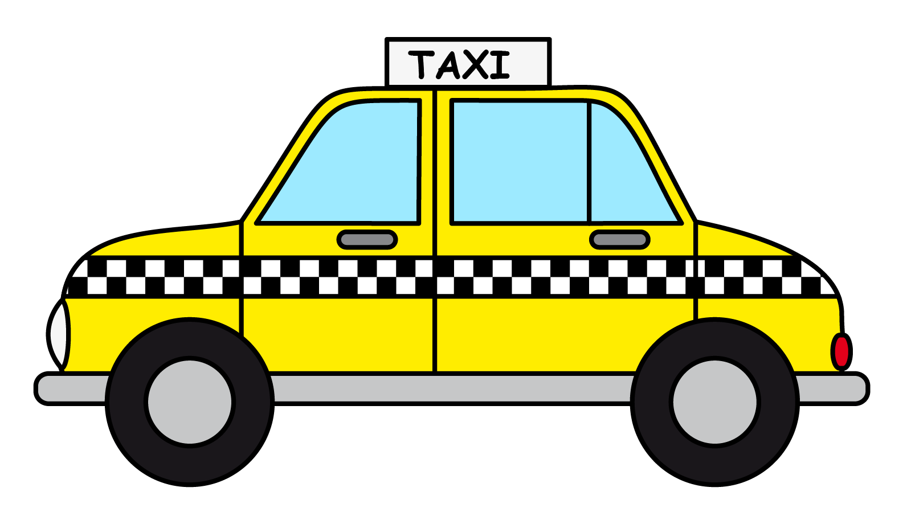

# Project instructions


> [!IMPORTANT]
>
> ### 
>
> This is a final project for course 1. This will not be graded, and is
> intended to provide you with the opportunity to test the skills you’ve
> acquired throughout the course in a less structured environment.
> This project is also structured for you to host on a webpage and link as proof of work on your resume / cv. 
>
> Rubric items can be found at the end of the README in the Self rubric section to help self-assessment of your project. Do not expand the rubric items until you have finished a draft of your project. 


## Instructions

This final project consists of an exploratory data analysis and write up
of results you discover. The data set you will be working with is a pre-packaged R data set
called `taxi`. Your write up, in the project qmd, will consist of three sections.



**Introduction** - The introduction should be a brief summary of the data you are working with in your own words, and the research question(s) you aim to address in your write up. 

**Results** - The results section should include visualizations and
summary statistics relevant to your research question(s). These should
be accompanied with written descriptions.

**Discussion** - The discussion section should include a written summary of
what you have learned about your research question(s) and describe the key results from your analysis.

## Description 

These data contain information on a subset of taxi trips in the city of Chicago in 2022. Researchers are interested in 
what factors contribute to a passanger tipping their driver. A data table can be seen below:

| variable    | description                                                             |
|-------------|-------------------------------------------------------------------------|
| `tip`    | Whether the rider left a tip. A factor with levels "yes" and "no"|
| `distance`    | The trip distance, in odometer miles|
| `company` | The taxi company, as a factor. Companies that occurred few times were binned as "other" |
| `Time`  | time of requested loan                                     |
| `local`    | Whether the trip's starting and ending locations are in the same community. See the source data for community area values|
| `dow`    | The day of the week in which the trip began, as a factor|
| `month`    | The month in which the trip began, as a factor                                               |
| `hour`    | The hour of the day in which the trip began, as a numeric|

Specifically, you are tasked to investigate if there there a relationship between the distance (in miles) someone travels in a taxi, and if they tip or not? Does this relationship change if the taxi ride is on the weekend (Sat; Sun) vs the weekday?

You are also tasked to investigate if taxi passengers tend to tip more for the company Chicago Independents than the other companies?


Hint: you may need to make a new variable in order to answer the second
research question. You may also find the function
[`if_else()`](https://dplyr.tidyverse.org/reference/if_else.html)
useful.

> [!IMPORTANT]
>
> ### 
>
>  height="25" /> - **Version control with GitHub** <br> This project
> also provides you with the opportunity to practice using version
> control, often expected to be used in a real-world context. We
> challenge you to **Render**; **Commit**; and **Push** after each
> visualization or summary statistics you create. If you are working on
> a project with more than one contribute, make sure that you **Pull**
> before making any progress to ensure your project matches up with the
> project repository.

## Displaying code

Depending on the purpose of the project, it may be advantageous to either show or hide all of your code in your rendered document. To hide all of your code, set `echo: false` in your YAML. If you want to display your code, set `echo: true`.   
 
 
## Citations 

When working on your project, you may want to include outside sources. When doing so, we need to make sure these sources are properly cited. In order to do so, we need to create a .bib file and specify it in your index.qmd's YAML heading. Your project files include a references.bib txt file. This is where you will put bibtex entries. An example of an entry to be referenced can be seen below: 

```
@article{Cetinkaya2020,
	title        = {A Fresh Look at Introductory Data Science},
	author       = {Cetinkaya, Mine and Ellison, Victoria},
	year         = 2020,
	month        = {08},
	journal      = {Journal of Statistics Education},
	volume       = 29,
	pages        = {1--27},
	doi          = {10.1080/10691898.2020.1804497}
}
```
In this entry above, Cetinkaya2020 is the citation identifier. To default way to cite an entry in your text is with this syntax: [@citation-identifier].

To automatically generate a references section with your entries, the path to the .bib file needs to be specified in your YAML with bibliography: references.bib. This has been done for you. 

## Self rubric

Below are a collection of rubric items to self assess your report.


<details>
  <summary>Rubric items</summary>
 - Report should include 1-2 visualizations with accompanying summary
   statistics per research question.

 - All visualizations should be appropriately labeled, including having
   a title and customized axes.

 - Only plots and summary statistics that are relevant to the research
   question(s) should be created.

 - Should come to the conclusion that there is a relationship between longer
   taxi rides and those who tip (~ 2 miles difference between tip and no tip).

 - Should come to the conclusion that, regardless if the taxi ride is on a weekday or weekend, passangers who tip tend to be riding for a longer distance.
   taxi rides and those who tip (~ 2 miles difference between tip and no tip).

 - Should come to the conclusion that there is some to little evidence of a relationship between those who tip for Chicago Independents (94.8% of the time) and the rest of the companies (91.8%).

</details>

## Acknowledgements

This final project was inspired from a tidymodels data set. 

Kuhn M (2024). modeldata: Data Sets Useful for Modeling Examples. R package version 1.3.0, https://github.com/tidymodels/modeldata, https://modeldata.tidymodels.org.
