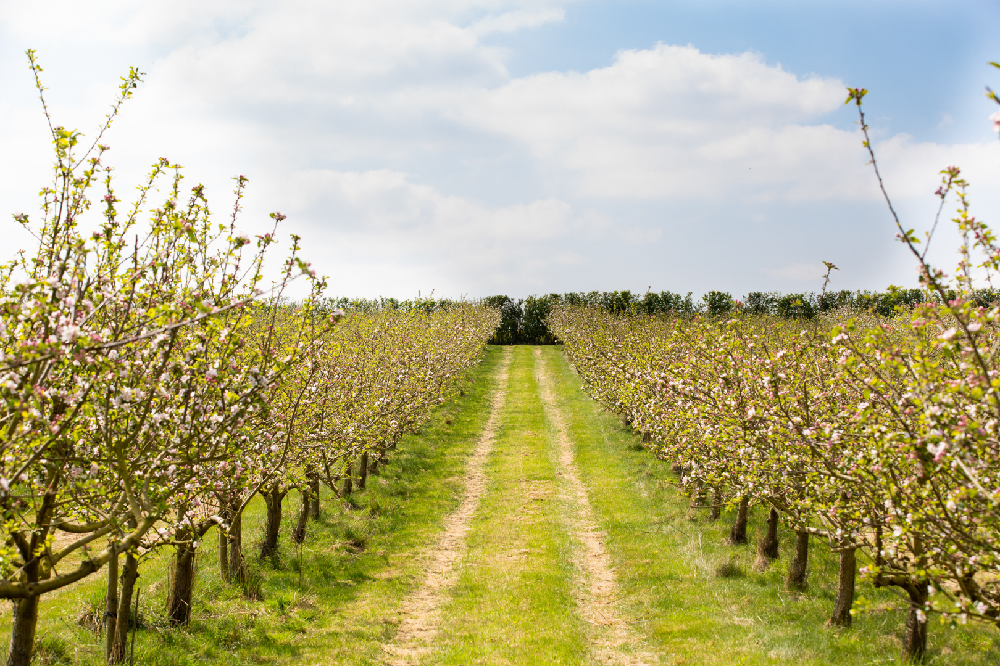

# Project instructions

> [!IMPORTANT]
>
> ### 
>
> This is a final project for course 1. This will not be graded, and is
> intended to provide you with the opportunity to test the skills you’ve
> acquired throughout the course in a less structured environment.
> This project is also structured for you to host on a webpage and link as proof of work on your resume / cv. 
>
> Rubric items can be found at the end of the README in the Self rubric section to help self-assessment of your project. Do not expand the rubric items until you have finished a draft of your project. 

## Instructions

This final project consists of an exploratory data analysis and write up
of results you discovered. The data set you will be working with is
called `OrchardSprays`. Your write up will consist of three sections.

**Introduction** - The introduction contains more information about your
data set and the research question(s) you are tasked to investigate.

**Methods** - The methods section should include visualizations and
summary statistics relevant to your research question(s). These should
be accompanied with written descriptions.

**Discussion** - In this section you’ll include a written summary of
what you have learned about your research question(s), will discuss your
overall findings, and describe the key results from your analysis.

## Introduction

An orchard is a plantation of trees or shrubs that is maintained for
food production. Often, pesticides are used to control for various pests
and disease carriers. However, an unintended consequence of using
pesticides is the deterrent of honeybees. The presence of honeybees in
orchards is crucial for the production of food.

Researchers conducted an experiment to assess the potency of various
pesticides in repelling honeybees. There was a total of 8 different
levels of pesticide (`treatment`) with varying amounts of lime sulphur.
Each of these 8 treatments were used 8 times, randomly assigned to the
orchard that was divided into 64 squares.

The response variable (`decrease`) for the different treatment levels of
pesticides were obtained by releasing 100 bees into each square for 2
hours and measuring the decrease in volume of the solutions. A decrease
in solution means that the honey bees are not repelled and are visiting
the plants as normal \[@mcneil1977\].

A data table for this experiment can be seen below:

| variable    | description                                                             |
|-------------|-------------------------------------------------------------------------|
| `rowpos`    | numeric row of the design                                               |
| `colpos`    | numeric column of the design                                            |
| `treatment` | treatment level (A having the highest level … H having no lime sulphur) |
| `decrease`  | decrease in volume of the solutions                                     |

**Research Question**: You are tasked to investigate which treatment(s)
of pesticides produced the highest decrease in solution. Additionally,
you are interested in seeing if, regardless of treatment, the first four
rows of the orchard showed more or less of a decrease in solutions than
the last four rows.

Hint: you may need to make a new variable in order to answer the second
research question. You may also find the function
[`if_else()`](https://dplyr.tidyverse.org/reference/if_else.html)
useful.

> [!IMPORTANT]
>
> ### 
>
>  height="25" /> - **Version control with GitHub**   This project
> also provides you with the opportunity to practice using version
> control, often expected to be used in a real-world context. We
> challenge you to **Render**; **Commit**; and **Push** after each
> visualization or summary statistics you create. If you are working on
> a project with more than one contribute, make sure that you **Pull**
> before making any progress to ensure your project matches up with the
> project repository.

## Methods

Write / create here.

## Discussion

Write here.

## Self rubric

Below are a collection of rubric items to self assess your report.

  
Rubric items

 - Report should include 1-2 visualizations with accompanying summary
   statistics per research question.

 - All visualizations should be appropriately labeled, including having
   a title and customized axes.

 - Only plots and summary statistics that are relevant to the research
   question(s) should be created.

 - Should come to the conclusion that the more potent the pesticide,
   the less decrease in volume of solution.

 - Should come to the conclusion that regardless of treatment, the mean
   decrease is volume of solution is roughly 10 more for the top 4 rows
   than the bottom 4 rows.

## References
